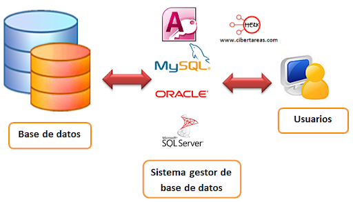

# Tema 1: Sistemas de Almacenamiento de la Información

---
### RESULTADOS DE APRENDIZAJE

__RA1:__ Reconoce los elementos de las bases de datos analizando sus funciones y valorando la utilidad de los sistemas gestores.

### CRITERIOS DE EVALUACIÓN

__CE1a:__ Se han analizado los sistemas lógicos de almacenamiento y sus características.

__CE1b:__ Se han identificado los distintos tipos de bases de datos según el modelo de datos utilizado.

__CE1c:__ Se han identificado los distintos tipos de bases de datos en función de la ubicación de la información.
    
__CE1d:__ Se ha evaluado la utilidad de un sistema gestor de bases de datos.
    
__CE1e:__ Se ha reconocido la función de cada uno de los elementos de un sistema gestor de bases de datos.

__CE1f:__ Se han clasificado los sistemas gestores de bases de datos.

__CE1i:__ Se ha identificado la legislación vigente sobre protección de datos.

---
## 1. INTRODUCCIÓN
¿Te has preguntado alguna vez dónde y de qué manera se almacenan y gestionan los datos que utilizamos diariamente? Si pensamos en cualquier acción de nuestra vida cotidiana, o si analizamos la mayoría de los ámbitos de actividad, nos encontramos que la utilización de las bases de datos está ampliamente extendida. Éstas, y los datos contenidos en ellas, serán imprescindibles para llevar a cabo multitud de acciones.

* Cuando operamos en el cajero automático.
* Al solicitar un certificado en un organismo público.
* Cuando acudimos a la consulta del médico.
* Al inscribirnos en un curso, plataforma OnLine, etc.
* Si utilizas un GPS.
* Cuando reservamos unas localidades para un evento deportivo o espectáculo.
* Si consumimos ocio digital.
* Cuando consultamos cualquier información en Internet. (Bibliotecas, enciclopedias, museos, etc.)
* Al registrarte en una página de juegos OnLine, redes sociales o foros.
* Incluso, si tienes coche, puede ser que éste incorpore alguna base de datos.

Suponemos que no es necesario que continuemos más para darnos cuenta de que casi todo lo que nos rodea, en alguna medida, está relacionado con los datos, su almacenamiento y su gestión. El gran volumen de datos que actualmente manejamos y sus innumerables posibilidades requieren de la existencia de técnicos perfectamente formados y capaces de trabajar con ellos.

Los __datos__ son elementos básicos que representan hechos, valores o registros sin un significado completo por sí mismos, como números, textos o fechas. Cuando estos datos se organizan, procesan e interpretan, se transforman en __información__, que resulta útil para la toma de decisiones y el funcionamiento de las aplicaciones.

---

## 2. Evolución de los Sistemas de Almacenamiento de la Información

### 2.1 Fichero manual

Hasta hace unas décadas, la información se almacenaba en **soporte papel**, organizada en carpetas y archivadores.

Ejemplos:

- Expedientes académicos
- Historias clínicas
- Fichas de clientes o proveedores


Este sistema dejó de ser eficiente cuando el volumen de información aumentó.

---

### 2.2 Sistemas de ficheros

Las primeras aplicaciones informáticas almacenaban los datos en **archicos o ficheros** manejados directamente por los programas.

¿Qué es entoces un fichero o archivo?
Debemos saber que existen diferentes tipos de fichero según su formato o estructura.

Pero por lo general podemos definirlo como:

!!! definition "Definición" 
    Un archivo o fichero es un conjunto organizado  de datos relacionados entre sí, que se almacenan de forma permanente en un  dispositivo de almacenamiento (HDD,SSD,USB,etc...), y que pueden ser    recuperados, modificados o procesados posteriormente por un sistema informático.

El formaro se refiere a como están representado los datos dentro del fichero siendo de texto (.txt, .csv, .xml, .json) o ficheros binarios (.exe, .dat, .jpg, .mp3).

Ejemplo de un fichero de texto llamado proveedores.txt:
```
Juan Pérez García,678123456,Madrid,juan.perez@gmail.com;
María López Sánchez,654987321,Barcelona,maria.lopez@hotmail.com;
Carlos Ruiz Martín,612345678,Valencia,carlos.ruiz@yahoo.es;
Ana Gómez Torres,699112233,Sevilla,ana.gomez@outlook.com;
Luis Fernández Mora,622334455,Bilbao,luis.fernandez@gmail.com;
```

Los datos dentro del fichero debe tener una organización o estructura para que puedan ser leída desde algún programa. En el fichero anterior:

* cada línea es un registro ya que todos los datos de la misma pertenecen a un mismo proveedor.
* los registros están separados por punto y com (;).
* cada registro esta compuestos por los campos (nombre y apelidos, teléfono, ciudad, email).
* los campos están separados por coma (,).

---

### 2.3 Tipos de Acceso 

Según la manera que tengamos de acceder a un registros los ficheros se clasifican en varios tipors:

**Secuenciales:** Los registros se almacenan de forma contigua y ordenada.

Ventajas:

- Acceso rápido a bloques contiguos

- No hay desperdicio de espacio

Inconvenientes:

- Acceso lento a registros concretos
- No permite inserciones intermedias
- Borrado lógico

**Acceso Directo o Aleatorio:**

Permite acceder a un registro directamente mediante una clave **(indexados)** o un puntero con la dirección al siguiente registros **(encadenados)**.

Características:

- Acceso inmediato
- Registros de longitud fija
- Actualización en tiempo real
- Uso de discos magnéticos

### 2.4 Inconvenientes de los Ficheros.

Esta forma de guardar la información tiene muchos inconvenientes:

* **Redundacia de datos**
* **Problemas de seguridad**
* **Problemas de acceso concurrente**
* **Dificultad a la hora de acceder a los datos relacionados**
* **Dependencia del SW respecto a los datos**
* **Dificultad de recuperación de archivos**

Los ficheros fueron una solución mientras se accedia a la información desde una única aplicación, pero cuando se empezaron a desarrollar las redes, internet, necesidad de utilizar los mismos recursos por varios usuarios a la vez, etc. Los problemas antes mencionados hicieron que este sistema no fuera viable y para solucionarlo se desarrollaron las bases de datos.

### 2.5 Sistemas de bases de datos

Los sistemas de bases de datos son lugares donde poder almacenar la información de forma estructurada, sin redundancia, fácil acceso y con independencia de los programas que las utilizan.

!!! definition "Base de datos"
    Una **base de datos** es un conjunto organizado de datos relacionados entre sí, almacenados de forma estructurada, que pueden ser accedidos, consultados y actualizados por uno o varios usuarios o aplicaciones de manera eficiente y segura.

**Ventajas de las bases de datos**

- Control de redundancia
- Integridad de la información
- Acceso múltiple
- Permite el control de permisos a los usuarios sobre los datos
- Protección frente a fallos
- Independencia de los datos sobre las aplicaciones

---
## 3. Modelos de Bases de Datos

Un **modelo de datos** es un conjunto de herramientas para describir datos, relaciones y restricciones.

* **Modelo Jerárquico** (principios años 60) organiza los datos en una estructura de **árbol invertido**, donde cada registro padre puede tener varios hijos, pero cada hijo solo puede tener un único padre. Es adecuado para representar relaciones **1:N**, pero poco flexible para relaciones más complejas.

* **Modelo en red** (finales de los años 60) organiza los datos mediante una estructura de **grafo**, en la que un registro puede tener **varios padres y varios hijos** permitiendo relaciones **N:M (muchos a muchos)**. Es más flexible que el jerárquico, pero complejo de diseñar y mantener.

* **Modelo relacional** (fue propuesto por Edgar F. Codd en 1970) representa los datos mediante **tablas (relaciones)**, formadas por filas (registros) y columnas (campos), relacionando las tablas entre sí mediante claves.
Es el modelo más utilizado en la actualidad. Destaca por su **simplicidad**, **independencia de los datos** y el uso del lenguaje **SQL** para realizar consultas.

* **Modelo orientado a objetos** (años 80 y principios de los 90) organiza los datos como **objetos**, que integran tanto los datos como los métodos que operan sobre ellos, siguiendo los principios de la programación orientada a objetos. Es adecuado para aplicaciones complejas, aunque su uso es menos común que el modelo relacional.

---

### 3.1 Repercusión de Internet en los modelos de datos

La aparición y expansión de **Internet** ha tenido un impacto decisivo en la forma en que se almacenan, gestionan y acceden a los datos. Los modelos de datos tradicionales, pensados para sistemas locales y centralizados, han tenido que evolucionar para dar respuesta a nuevas necesidades como la **escala global**, el **acceso concurrente masivo** y la **disponibilidad continua**.

---

**Cambios introducidos por Internet**

!!! info "Cambios clave"
    Internet ha provocado un crecimiento exponencial del volumen de datos y del número de usuarios que acceden a ellos de forma simultánea.

Principales consecuencias:

- Necesidad de **bases de datos distribuidas**
- Acceso desde **ubicaciones geográficas diferentes**
- Altos niveles de **concurrencia**
- Requisitos de **alta disponibilidad y tolerancia a fallos**
- Integración con aplicaciones web y móviles

---

### 3.2 Evolución de los modelos de datos

Los modelos clásicos (jerárquico, en red y relacional) no siempre son suficientes para afrontar las demandas de las aplicaciones modernas basadas en Internet. Como resultado, han surgido o se han popularizado nuevos modelos de datos.

---

#### 3.2.1 Modelo relacional en entornos web

!!! definition "Relacional en Internet"
    El **modelo relacional** se ha adaptado a Internet mediante el uso de arquitecturas cliente-servidor, bases de datos distribuidas y replicación de datos.

Sigue siendo el modelo más utilizado en aplicaciones web tradicionales
(e-commerce, gestión empresarial, sistemas bancarios).

---

**Técnicas de fragmentación** 

!!! info "Fragmentación"
    La **fragmentación** es una técnica utilizada en bases de datos distribuidas para **dividir una base de datos en partes más pequeñas**, llamadas fragmentos, que se almacenan en diferentes nodos.

El objetivo es:

- Mejorar el rendimiento
- Reducir el tráfico de red
- Acercar los datos a los usuarios que los utilizan

---

**Fragmentación horizontal**

!!! definition "Fragmentación horizontal"
    Consiste en dividir una tabla en **subconjuntos de filas (registros)** según una condición.

Cada fragmento contiene **los mismos campos**, pero diferentes registros.

!!! tip "Ejemplo:"
    Clientes de Madrid en un servidor y clientes de Valencia en otro.

---

**Fragmentación vertical** 

!!! definition "Fragmentación vertical"
    Consiste en dividir una tabla en **subconjuntos de columnas (campos)**,
    manteniendo siempre la clave primaria.

Cada fragmento contiene distintos atributos de la misma tabla.

!!! tip "Ejemplo:"
    Un fragmento con datos personales y otro con datos económicos.

---

**Fragmentación mixta** 

!!! definition "Fragmentación mixta"
    Combina la **fragmentación horizontal y vertical**, dividiendo primero por filas y después por columnas (o al revés).

Es la técnica más flexible, pero también la más compleja de implementar.

---

#### 3.2.2 Modelos NoSQL 

!!! definition "Modelos NoSQL"
    Los **modelos NoSQL** agrupan distintos tipos de bases de datos diseñadas para trabajar en entornos distribuidos, con grandes volúmenes de datos y alta escalabilidad.

**Origen:** comienzan a popularizarse a partir de **2008**, con el auge de Internet y las grandes plataformas web.

Tipos principales:

- **Clave-valor** (Redis, DynamoDB)
- **Documentos** (MongoDB)
- **Columnas** (Cassandra)
- **Grafos** (Neo4j)

---

**Modelo de datos documental**

!!! definition "Modelo documental"
    El **modelo documental** almacena la información en documentos semi-estructurados, normalmente en formato **JSON** o **BSON**, facilitando su uso en aplicaciones web.

Muy utilizado en APIs REST y aplicaciones web modernas.

---

**Modelo de grafos** 

!!! definition "Modelo de grafos"
    El **modelo de grafos** representa los datos mediante nodos y relaciones, lo que facilita el modelado de redes sociales, recomendaciones y relaciones complejas.

Especialmente útil en aplicaciones basadas en Internet como redes sociales.

---

#### 3.2.3 Bases de datos distribuidas y en la nube

!!! tip "Internet y la nube"
    Internet ha impulsado el uso de bases de datos en la **nube**, donde los datos se almacenan y gestionan de forma distribuida en múltiples servidores.

Características:

- Escalabilidad horizontal
- Alta disponibilidad
- Replicación automática
- Acceso global

---

## 4. Sistemas Gestores de Bases de Datos (SGBD)

El Sistema gestor de la base de datos (SGBD) es una aplicación que permite a los usuarios definir, crear, manipular y administras Bases de datos.



--- 

**Funciones**

Las funciones de un SGBD son:

* Asegurar la independencia de los datos respecto a las aplicaciones y los usuarios.
* Ofrecer eficiencia y seguridad a la hora de extraer o almacenar información en una base de datos, protegiendo el acceso a usuarios sin los permisos adecuados.
* Asegurar la integridad de los datos en todo momento, detectando las operaciones erróneas que introducen inconsistencia en los datos y permitiendo el uso de transacciones en las operaciones.
* Permitir el acceso concurrente y recuperación en caso de fallo (tolerancia a fallos).
* Facilitar la administración de los datos.

---

**Componentes de un SGBD**

Un **Sistema Gestor de Bases de Datos (SGBD)** está formado por varios componentes que trabajan conjuntamente para almacenar, gestionar y proteger los datos.

---

**1. Lenguajes del SGBD**

!!! definition "Lenguajes del SGBD"
    Son los lenguajes que permiten definir la estructura de la base de datos y manipular la información almacenada en ella.

Incluyen:

- **DDL (Lenguaje de Definición de Datos)**  
  Permite crear, modificar y eliminar estructuras de la base de datos  
  (tablas, vistas, índices, etc.).

- **DML (Lenguaje de Manipulación de Datos)**  
  Permite consultar y modificar los datos (`SELECT`, `INSERT`, `UPDATE`, `DELETE`).

- **DCL (Lenguaje de Control de Datos)**  
  Permite gestionar permisos y seguridad (`GRANT`, `REVOKE`).

---

**2. Diccionario de datos** 

!!! definition "Diccionario de datos"
    Es un conjunto de **metadatos** que describe la estructura de la base de datos: tablas, campos, tipos de datos, relaciones y restricciones.

Permite al SGBD conocer cómo están organizados los datos.

---

**3. Motor de almacenamiento**

!!! definition "Motor de almacenamiento"
    Es el componente encargado de **gestionar físicamente** cómo se almacenan los
    datos en el disco y cómo se recuperan.

Funciones principales:

- Gestión de archivos
- Acceso a bloques de datos
- Optimización del almacenamiento

---

**4. Gestor de consultas** 

!!! definition "Gestor de consultas"
    Se encarga de interpretar, optimizar y ejecutar las consultas realizadas por los usuarios o aplicaciones.

Decide la forma más eficiente de acceder a los datos.

---

**5. Gestor de transacciones** 

!!! definition "Gestor de transacciones"
    Controla las **transacciones**, garantizando que se cumplan las propiedades **ACID** (Atomicidad, Consistencia, Aislamiento y Durabilidad).

Fundamental para mantener la integridad de los datos.

---

**6. Gestor de concurrencia** 

!!! definition "Gestor de concurrencia"
    Permite que varios usuarios accedan a la base de datos simultáneamente sin provocar inconsistencias.

Utiliza mecanismos como bloqueos y control de versiones.

---

**7. Gestor de seguridad** 

!!! definition "Gestor de seguridad"
    Controla el acceso a la base de datos, asegurando que solo los usuarios
    autorizados puedan realizar determinadas operaciones.

Incluye:

- Usuarios
- Roles
- Permisos

---

**8. Sistema de copias de seguridad y recuperación** 

!!! definition "Copias de seguridad y recuperación"
    Permite realizar **backups** y recuperar la base de datos en caso de fallos, errores o pérdidas de información.

Esencial para la fiabilidad del sistema.

---

**9. Interfaces de usuario y aplicaciones** 

!!! definition "Interfaces del SGBD"
    Son los medios que permiten a los usuarios y aplicaciones comunicarse con el SGBD.

Ejemplos:

- Consolas de administración
- Interfaces gráficas
- APIs para lenguajes de programación

---

## 5. Tipos de Sistemas Gestores de Bases de Datos (SGBD)

Los **Sistemas Gestores de Bases de Datos (SGBD)** pueden clasificarse atendiendo a distintos criterios, según sus características y el uso que se les da.

* Según el modelo de datos
* Según el número de usuarios: **Monousuario**, **Multiusuario**  
* Según la distribución de los datos: **Centralizados**, **Distribuidos**  
* Según el propósito: **De propósito general**,**De propósito específico**  
* Según el coste: **SGBD comerciales**, **SGBD libres o de código abierto**  

---

## 6. Legislación sobre la protección de datos

En el desarrollo de aplicaciones y en la gestión de bases de datos es habitual tratar con **datos personales**, por lo que es imprescindible conocer la legislación que regula su uso, almacenamiento y protección.

En España, la protección de datos personales está regulada principalmente por la normativa europea y nacional, cuyo objetivo es **garantizar los derechos y libertades de las personas** respecto al tratamiento de sus datos.

---

**¿Qué se entiende por dato personal?** 

!!! definition "Dato personal"
    Se considera **dato personal** cualquier información que identifique o pueda identificar a una persona física.

Ejemplos:

- Nombre y apellidos
- DNI
- Dirección
- Teléfono
- Correo electrónico
- Dirección IP
- Datos académicos o laborales

En bases de datos, la mayoría de la información que se gestiona suele contener datos personales.

---

**Normativa aplicable en España**

!!! info "Marco legal"
    La legislación española en materia de protección de datos se basa en dos normas fundamentales:

- **Reglamento General de Protección de Datos (RGPD)**  
  Normativa de la Unión Europea de aplicación directa en todos los estados miembros desde **2018**.

- **Ley Orgánica de Protección de Datos Personales y garantía de los derechos digitales (LOPDGDD)**  
  Ley española que adapta el RGPD al ordenamiento jurídico nacional.

---

**Principios de la protección de datos** 

!!! definition "Principios del tratamiento de datos"
    El tratamiento de datos personales debe cumplir una serie de principios básicos:

- **Licitud, lealtad y transparencia**  
  Los datos deben recogerse de forma legal e informando al usuario.

- **Limitación de la finalidad**  
  Los datos solo pueden usarse para el fin para el que fueron recogidos.

- **Minimización de datos**  
  Solo se deben almacenar los datos estrictamente necesarios.

- **Exactitud**  
  Los datos deben ser correctos y estar actualizados.

- **Limitación del plazo de conservación**  
  No deben conservarse más tiempo del necesario.

- **Integridad y confidencialidad**  
  Los datos deben protegerse frente a accesos no autorizados.

---

**Derechos de las personas (Derechos ARSULIPO)** 

!!! definition "Derechos de los usuarios"
    La legislación reconoce una serie de derechos a las personas sobre sus datos personales, conocidos como **derechos ARSULIPO**.

Incluyen:

- **Acceso**: conocer qué datos se están tratando
- **Rectificación**: corregir datos incorrectos
- **Supresión** (derecho al olvido): eliminar los datos
- **Limitación del tratamiento**
- **Portabilidad**: recibir los datos en formato estructurado
- **Oposición**: oponerse al tratamiento de los datos

Las aplicaciones deben facilitar el ejercicio de estos derechos.

---

**Obligaciones del responsable del tratamiento** 

!!! definition "Responsable del tratamiento"
    Es la persona o entidad que decide cómo y para qué se tratan los datos personales.

Obligaciones principales:

- Garantizar la seguridad de los datos
- Aplicar medidas técnicas y organizativas adecuadas
- Informar al usuario del tratamiento de sus datos
- Notificar brechas de seguridad
- Cumplir los principios del RGPD

---

**Medidas de seguridad en bases de datos** 

!!! tip "Relación con Bases de Datos"
    En el ámbito de las bases de datos, la protección de datos implica aplicar medidas de seguridad técnicas.

Ejemplos:

- Control de acceso mediante usuarios y permisos
- Cifrado de datos
- Copias de seguridad
- Registro de accesos
- Uso de contraseñas seguras

El SGBD juega un papel fundamental en la protección de los datos personales.

---

**Importancia para el desarrollador DAW**

!!! warning "Responsabilidad profesional"
    Un desarrollador es responsable del correcto tratamiento de los datos personales en las aplicaciones que desarrolla.

Consecuencias del incumplimiento:

- Sanciones económicas
- Responsabilidad legal
- Pérdida de confianza de los usuarios

---