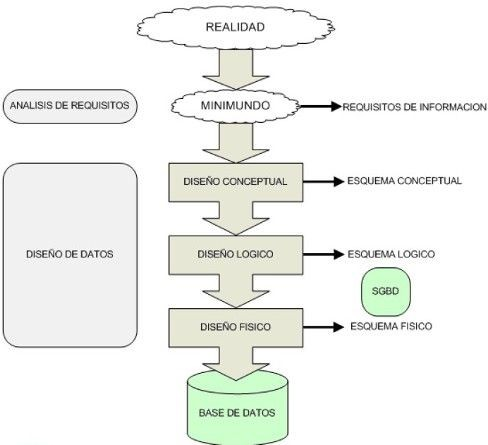

El diseño de Base de Datos desempeña un papel central en el empleo de los recursos de información en la mayoría de las organizaciones.

Se han desarrollado metodologías y técnicas de diseño y se ha alcanzando un consenso sobre la descomposición del proceso en fases, sobre los principales objetivos de cada fase y sobre las técnicas para conseguir estos objetivos.

Así, el diseño de una Base de Datos se descompone en : Diseño Conceptual, Diseño Lógico y Diseño Físico:

{ .center }

El **diseño conceptual** parte de las especificaciones de requisitos de usuario y su resultado es el __esquema conceptual__ de la Base de Datos. Un esquema conceptual es una descripción de alto nivel de la estructura de la Base de Datos, **independientemente del SGBD** que se vaya a utilizar. Los procesos de definición de requisitos y del diseño conceptual exigen identificar las exigencias de información de los usuarios y representarlos en un modelo bien definido.
