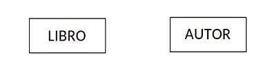
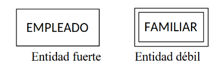

En el modelo E/R se puede distinguir como elementos fundamentales las **entidades**, los **atributos** y las **relaciones**.

Se puede definir la entidad como cualquier objeto (real o abstracto) acerca del cual queremos almacenar información en la base de datos.

Las entidades pueden ser de distinta naturaleza: objetos físicos (coches, libros, ...), personas (clientes, empleados, médicos, ...), lugares (ciudades, provincias, ...), organizaciones (hospitales, empresas), etc.

La representación gráfica de este objeto es un rectángulo etiquetado con el nombre del tipo de entidad, como podemos ver en la figura.

{ .center }

Existen dos clases de entidades: **regulares** (o fuertes), que son aquellas que tienen existencia por sí mismas, como LIBRO y AUTOR, y **débiles**, cuya existencia depende de otro tipo de entidad, por ejemplo, FAMILIAR depende de EMPLEADO, y la desaparición de un empleado de la BD hace que desaparezcan también todos los familiares que estaban a su cargo.

Los tipos de entidad débil se representan con dos rectángulos concéntricos con su nombre en el interior, como se ve en la figura.

{ .center }

**Ocurrencia de una entidad**

Es una instancia de una determinada entidad, es decir, una unidad del conjunto que representa la entidad. La entidad empleado tiene varias instancias que son cada uno de los empleados de la empresa, como por ejemplo, Jesús Corbalán.

!!! Warning "Advertencia"
    Cada entidad solo puede aparecer una sola vez en el modelo, con lo que no podemos reptir el nombre de una entidad en el mismo modelo.
