Se entiende por relación o interrelación aquella asociación o correspondencia existente entre entidades.

Representaremos el tipo de interrelación mediante un rombo etiquetado con el nombre de la interrelación, unido mediante arcos a los tipos de entidad que asocia. Generalmente los nombres de las relaciones corresponden a verbos, pues las relaciones suelen describir acciones entre dos o más entidades.

{ .center }

Entre dos tipos de entidad puede existir más de un tipo de interrelación.

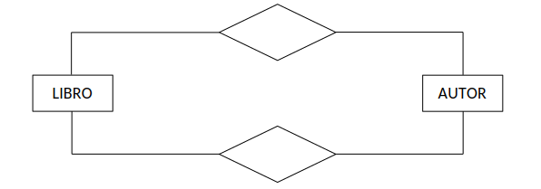{ .center }

## Elementos de un tipo de interrelación

### **Nombre:**

Como todo objeto del modelo E/R, cada tipo de relación tiene un nombre que lo distingue unívocamente del resto y mediante el cual ha de ser referenciado.

### **Grado:**

Es el número de tipos de entidad que participan en un tipo de interrelación.

1. **Grado 1 (relaciones unarias o reflexivas):** la misma entidad participa más de una vez en la relación.
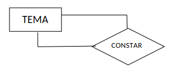{ .center }

2. **Grado 2 (relaciones binarias):** son dos las entidades que participan en la relación. Son las más comunes.
{ .center }

3. **Grado 3 (relaciones ternarias):** en la relación participan tres entidades.
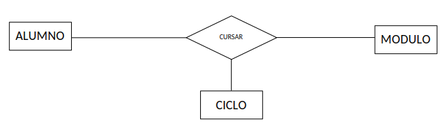{ .center }

4. **Grado n (relaciones n-arias donde n>3):** en la relación participan más de 3 entidades. Aparecen muy raras veces ya que generalmente se pueden descomponer en varias relaciones de grado 2 o de grado 3.

!!! tip "NOTA"
    Si en tu diagrama entidad relación aparecen relaciones de grado > 3 es posible que la interpretación de la realidad sea incorrecta. Incluso si aparecen relaciones de grado 3 **intenta** descomponerlas en relaciones de grado 2, siempre que no se pierda semántica.

### **Participación:**

Indica mediante una pareja de números el número máximo y mínimo de ocurrencias de un tipo de entidad que pueden estar interrelacionadas con una ocurrencia del otro tipo, u otros tipos de entidad que participan en el tipo de interrelación y que aparecen. Su representación gráfica es una etiqueta del tipo (0,1), (1,1), (0,n) o (1,n), según corresponda.

| Participación | Significado |
|:-------------:|:-----------|
| (0,1) | Mínimo cero, máximo uno |
| (1,1) | Mínimo uno, máximo uno |
| (0,n) | Mínimo cero, máximo n (muchos) |
| (1,n) | Mínimo uno, máximo n (muchos) |
*notación Chen*

Las reglas que definen la participación de una ocurrencia en una relación son *las reglas de empresa*, es decir, se reconocen a través de los requisitos del problema. Por ejemplo, los empleados pueden trabajar en varios proyectos o en ninguno (cuando están de vacaciones). En un proyecto puede trabajar mínimo 1 empleado, aunque puede haber más. Esto se representaría así:

{ .center }

Participación (EMPLEADO, TRABAJAR) = (0,n) un empleado no trabaja en ningún proyecto o en muchos proyectos.
Participación (PROYECTO, TRABAJAR) = (1,n) un proyecto tiene un empleado o muchos.

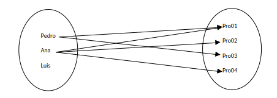{ .center }

!!! question "Autoevaluación"
    Cambia la participación (EMPLEADO, TRABAJAR) = (0,1) y participación (PROYECTO, TRABAJAR) = (1,1)¿Cómo se quedaría la relación? ¿ Cuáles se podrían quedar sin relacionar?

### **Cardinalidad:**

Es el número máximo de ocurrencias de cada tipo de entidad que pueden intervenir en una ocurrencia del tipo de interrelación que se está tratando; para representarlo gráficamente se pone etiqueta como 1:1, 1:N o N:M, según corresponda.

#### **Cardinalidad 1:1**

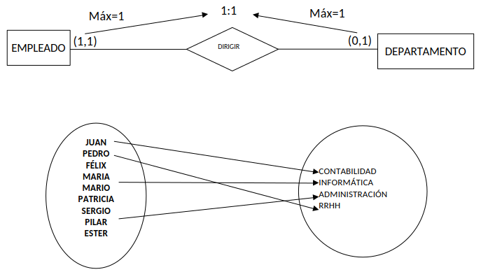{ .center }

La cardinalidad 1:1 de esta relación establece que un empleado o no es jefe o lo es de un solo departamento y un departamento sólo puede tener un empleado jefe.

#### **Cardinalidad 1:N**

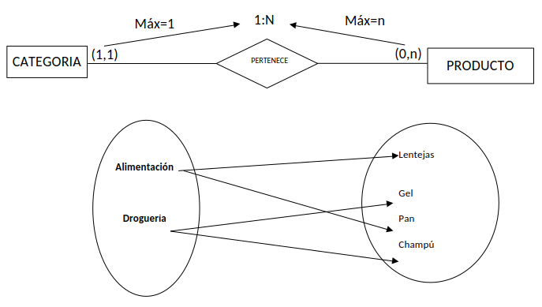{ .center }

La cardinalidad 1:N de esta relación especifica que un producto solo puede pertenecer a una categoría y que a una categoría pueden pertenecer varios productos

#### **Cardinalidad N:M**

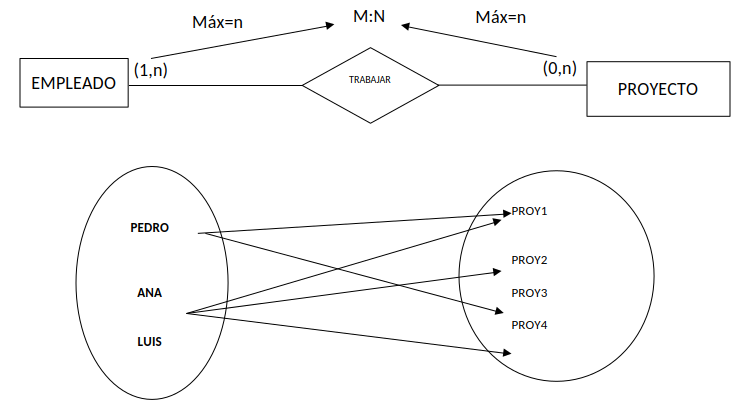{ .center }

La cardinalidad M:N (muchos a muchos) de esta relación permite que un empleado pueda trabajar en varios proyectos y que en un mismo proyecto puedan trabajar varios empleados.

#### **Cardinalidad en una relación ternaria**

Para calcular la cardinalidad de una relación ternaria se tomará una de las tres entidades y se combina con las otras dos. A continuación, se calcula la participación de la entidad en la combinación de las otras dos. Posteriormente, se hará lo mismo con las otras dos entidades. Finalmente, tomando los máximos de las participaciones se generan las cardinalidades.

Lo veremos mediante el siguiente ejemplo:

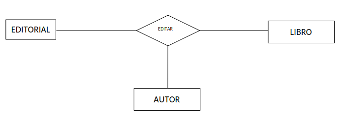{ .center }

Hay que responder a las siguientes preguntas:

Un autor con un  libro ¿En cuántas editoriales puede editar?
Mínimo 1, máximo 1. Participación de Autor y libro (1,1).

Un autor en una editorial ¿cuántos libros puede editar?
Mínimo 0. máximo n. Participación de autor y editorial (0,n).

Una editorial con un libro determinado ¿de cuántos autores es editado?
Mínimo 1, máximo n. Participación de editorial y libro (1,n).

Tomando los máximos de cada participación se obtiene que la cardinalidad de la relación es 1:N:M.

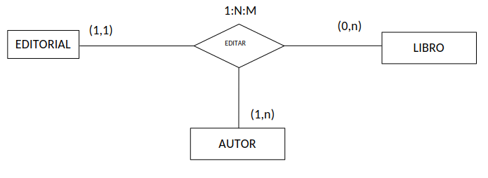{ .center }

Veamos otro ejemplo.

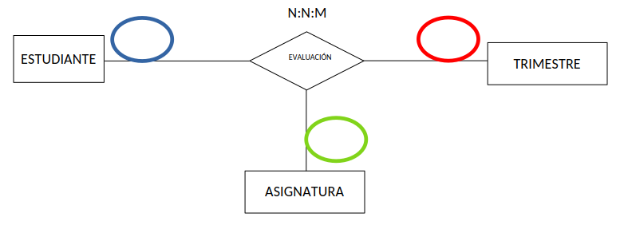{ .center }

Un estudiante en un trimestre se puede evaluar de 1 o varias asignaturas (1,n).

Un estudiante de una asignatura se puede evaluar en 1 o varios trimestres (1,n).

En un trimestre y de una asignatura se pueden evaluar 1 o varios estudiantes (1,n).

#### **Cardinalidad de las relaciones reflexivas**

En las relaciones reflexivas la misma entidad juega dos papeles distintos en la relación. Para calcular su cardinalidad hay que extraer las participaciones según los dos roles existentes. Por ejemplo, en la relación reflexiva “Es jefe”, la entidad Empleado aparece con dos roles. El primer rol es el empleado como jefe y el segundo rol es el empleado como subordinado. Así se puede calcular las participaciones preguntando:

¿Cuántos subordinados puede tener un jefe? Un jefe puede tener un mínimo de 0 (empleados que no son jefes) y un máximo de n: (0,n)

¿Cuántos jefes puede tener un subordinado? Un mínimo de 0 (un empleado sin jefes sería el responsable de la empresa) y un máximo de 1 (suponiendo una estructura típicamente jerárquica): (0,1)

Por lo tanto, la relación tendría la cardinalidad 1:N

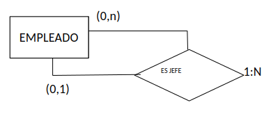{ .center }
