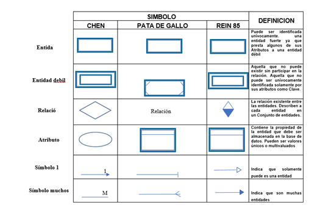
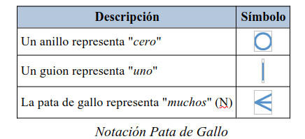
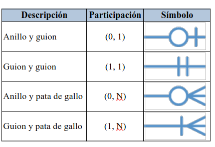
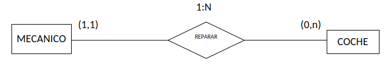

## Notación Pata de Gallo

{ .center }

{ .center }

La siguiente tabla muestra la equivalencia entre las dos notaciones Chen vs Pata de Gallo

{ .center }

!!!question "Autoevalución"
    Representa este gráfico en notación “Pata de Gallo” Cambia el gráfico si las participaciones fueran Participación(MECANICO, REPARAR) = (1,n) y Participación (COCHE, REPARAR) = (0,1). Representa el cambio en las dos notaciones

{ .center }
