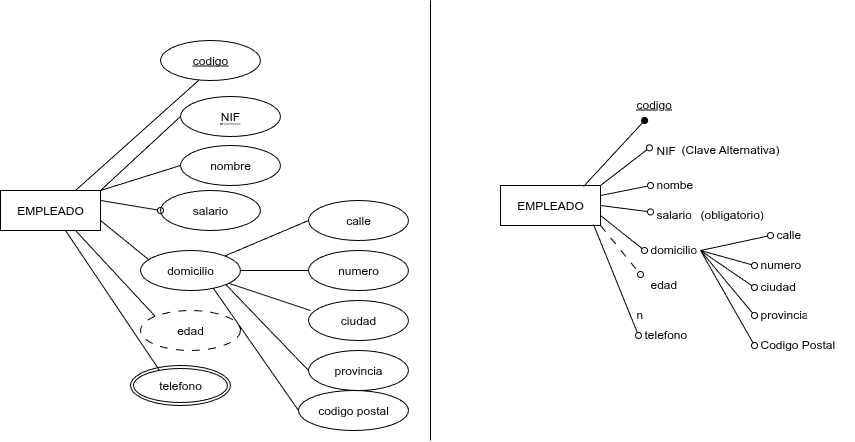
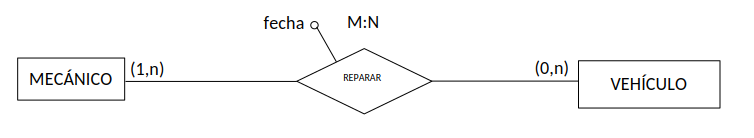

Cada una de las propiedades o características que tiene una entidad o una interrelación se denomina ATRIBUTO. En una misma entidad o interrealción no pueden tener dos atributos con el mismo nombre, pero sí en entidades diferentes.

Su representación gráfica es mediante elipses conectadas directamente a la entidad, como en la figura de la izquierda. Cuando la entidad tiene muchos atributos y/o hay muchas entidades y relaciones en el diagrama Entidad Relación, por razones de espacio, se pueden representar como en la figura de la derecha.

{ .center }

## Tipos de Atributos

- **Atributo Clave:** Entre todos los atributos de una entidad debemos elegir uno o varios que identifiquen unívocamente cada una de las ocurrencias de esa entidad. Este atributo o conjunto de atributos se denomina atributo clave. Para que un atributo sea clave debemos tener encuenta que el atributo siempre tiene que tener valor (no null) y que sea único (no se repita). En el ejemplo anterior, `Código` sería el atributo clave de la entidad `Empleado`, pues no hay dos personas con el mismo `Código`. Por tanto, si especificamos un `Código` concreto estaremos refiriéndonos a un único empleado.

Se suele representar mediante subrayado (figura de la izquierda) o rellenando el círculo correspondiente a dicho atributo (figura de la derecha).

Pueden haber entidades que sus ocurrencias se identifican por varios atributos, por ejemplo dos. Por ejemplo en una entidad `Reserva` los atributos clave puede ser `id_reserva` y la `fecha`.

- **Atributo Alternativo:** Sería el atributo que pudiendo ser atributo clave no lo hemos elegido como clave, ser representa subrayando con una linea discontinua. Por ejemplo `Nif`.

- **Atributo Compuesto:** Atributo que está compuestos por otros atributos más simples. Se representa conectando los óvalos simples al óvalo compuesto. Por ejemplo `dirección`.

- **Atributo Multivaluado:** Atributo que pueden tomar varios valores, se representa con un doble óvalo. En nuestro ejeplo tenemos el `Telefono` ya que podemos almacenar, el teléfono fijo, el móvil, etc.

- **Derivado:** Su valor se calcula a partir de otros atributos de la misma entidad, de otras entidades con las que se relaciona o a partir de un dato. Se representa mediante un óvalo con el borde discontinuo. Por ejemplo `Edad` se calcula a partir de la edad de nacimiento del cliente.

- **Opcional:** Significa que el atributo puede tener varlores nulos por defecto mientras no se diga lo contrario o sea un atributo clave o alternativo todos los atributo son opciones. En nuestro ejemplo `nombre, domicilio, edad, telefono`.

- **No Nulo:** Significa que el atributo es obligatorio, lo contrario que opcional, siempre tiene que tener un vaor diferente a null. Se representa con un círculo delante del óvalo. `salario` en nuestro ejemplor sería el atributo no nulo.

## Atributos de Relación

Las relaciones también pueden tener atributos. Su valor no depende de ninguna relación sino de la relación.

El atributo fecha de la relación `reparar` del ejemplo siguiente corresponde a la reparación de un determinado v`ehículo` por un determinado `mecánico`. La fecha de reparación no podría asignarse a la entidad `mecánico`, porque un mecánico realizará muchas reparaciones en diferentes fechas. Tampoco podríamos asignar la fecha de reparación a la entidad `vehículo`, ya que un mismo vehículo podrá ser reparado en diferentes fechas (diferentes reparaciones):

{ .center }

