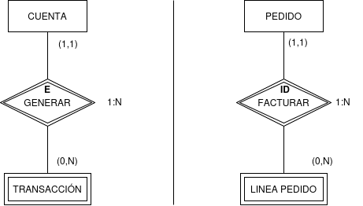

## Restinciones de Existencia e Identificador

Como en el caso de los tipos de entidad, los tipos de relaciones se clasifican también en fuertes y débiles, según estén asociando dos tipos de entidad fuertes, o un tipo de entidad débil con un tipo de entidad fuerte espectivamente.

**Existencia e Identificados**

Las entidades débiles presentan dos tipos de dependencia:

- **Dependencia en existencia:** cuando las ocurrencias de la entidad débil no pueden existir sin la entidad fuerte, si desaparece la ocurrencia de la entidad fuerte desaparecerá las ocurrencias de la entidad débil de la cual dependen. 

!!!tip "Importante"
    **La restricción de existencia** requiere siempre que la partcipación mínima sea 1 en la entidad fuerte (1,1).

- **Dependencia de identificación** cuando además de cumplirse la condición anterior, las ocurrencias de la entidad débil no se pueden identificar unívocamente mediante los atributos propios de la misma y exigen añadir la clave del la entidad fuerte de la que dependen. Una dependencia en identificación es siempre una dependencia en existencia (no ocurre lo contrario).

!!!tip "Importante"
    **La restricción de identificado** además de la participación mínima 1 en la entidad fuerte (1,1) la relación normalmente tedrá unca cardianlidad **1:N**

Si la dependencia es en identificación, el rombo que representa la interrelación va etiquetado con **ID**, y con una **E** en caso de que la dependencia sea sólo en existencia.

{ .center }
