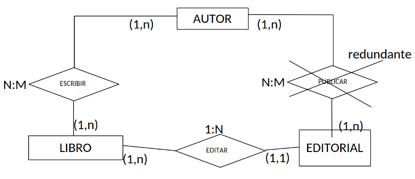
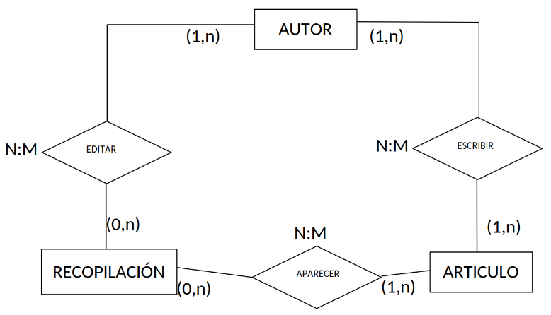

Una vez construido un esquema E/R hay que analizar si se presentan redundancias.

Además de la existencia de atributos redundantes, como los que se derivan de otros mediante algún cálculo y que deben ser eliminados del esquema E/R, hay que estudiar detenidamente los ciclos en el diagrama E/R, ya que **pueden** indicar la existencia de interrelaciones **redundantes**.

{ .center }

En el ejemplo anterior se da un ciclo entre `AUTOR`, `LIBRO` y `EDITORIAL`, por lo que en principio es posible que aparezca alguna interrelación redundante. En efecto, si se conocen los libros de un autor y las editoriales que los han editado, se puede deducir fácilmente en qué editoriales ha publicado dicho autor; de forma análoga, dada una editorial sabemos qué libros ha publicado, podemos deducir qué autores han escrito para ella, por lo que la interrelación `PUBLICAR` entre las entidades `AUTOR` y `EDITORIAL` es *redundante*.

Sin embargo, en esta otra figura, a pesar de existir un ciclo, no hay ninguna interrelación redundante. En lo que respecta a la interrelación `ESCRIBIR`, no puede deducirse de las otras dos, ya que aunque sepamos las recopilaciones que ha editado un `AUTOR` y los `ARTICULO` que han aparecido en ellas, no podemos saber los artículos que ha escrito dicho autor. La interrelación `EDITAR` tampoco es redundante, ya que un `AUTOR` escribe varios `ARTICULOS` que pueden aparecer en recopilaciones sin que eso implique que dicho autor edite esas recopilaciones. Por último, la interrelación `APARECER` tampoco es redundante, ya que un artículo escrito por un autor no tiene porqué aparecer necesariamente en las recopilaciones que éste edite: puede aparecer en otras recopilaciones o incluso en revistas, obsérvese la cardinalidad mínima cero en la entidad `RECOPILACIÓN` con respecto a la entidad `ARTÍCULO` en la interrelación aparece.

{ .center }

Existen además otros casos en los que la interrelación, a pesar de poder ser deducida a partir de otras presentes en el esquema, no se puede eliminar porque posee atributos.

Se puede decir, como norma general, que la existencia de un ciclo no implica la existencia de interrelaciones redundantes.
