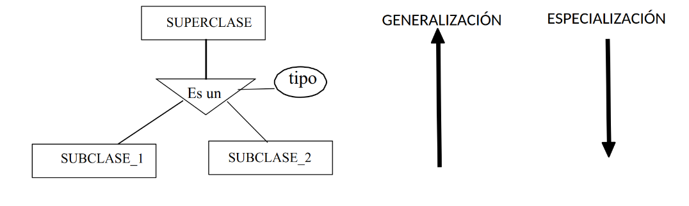
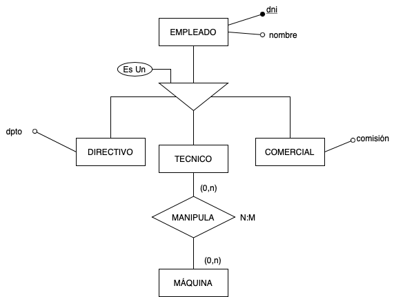

La descomposición de una entidad en varios subtipos o subclases es una necesidad muy habitual en el modelado de bases de datos. En el mundo real se pueden identificar *jerarquías* de entidades.

La **generalización/especialización** permite reflejar el hecho de que hay una entidad general, que denominamos entidad superclase, que se puede specializar en entidades subclase:

- La entidad **superclase** nos permite modelizar las características comunes de la entidad vista de una forma genérica.

- Las entidades **subclase** nos permiten modelizar las características propias de sus especializaciones. Es necesario que se cumpla que toda ocurrencia de una entidad subclase sea también una ocurrencia de su entidad superclase.

Una entidad E es una generalización de un grupo de entidades E1, E2, …. si cada ocurrencia de cada una de esas entidades es también una ocurrencia de E.

{.center}

En la generalización/especialización, las características (atributos o interrelaciones) de la entidad superclase se propagan hacia las entidades subclase. Es lo que se denomina **herencia** de propiedades.

Las subentidades son especializaciones de la entidad general (supertipo o superclase). La interrelación que se establece entre un supertipo y sus subtipos (o subclases) corresponde a la noción de **“es un” (IS A)**.

La relación de generalización/especialización se representa mediante un triángulo isósceles pegado por la base a la entidad superclase. En la figura siguiente `EMPLEADO` es la superclase y los `DIRECTIVOS`, `COMERCIALES` y `TECNICOS` son subclases. Cada subentidad tiene sus propios atributos y relaciones, pero todas heredan los -atributos- `nombre` y `DNI` de la entidad padre (`EMPLEADO`).

{.center}
