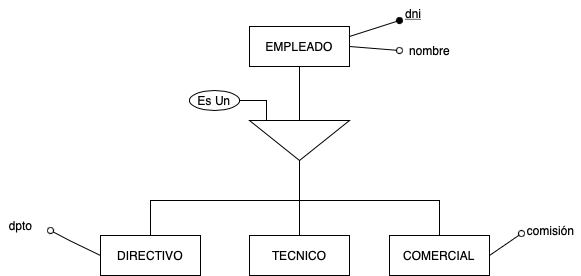
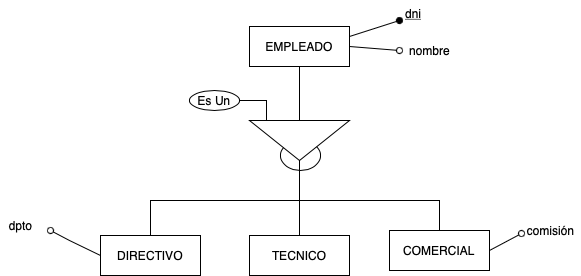
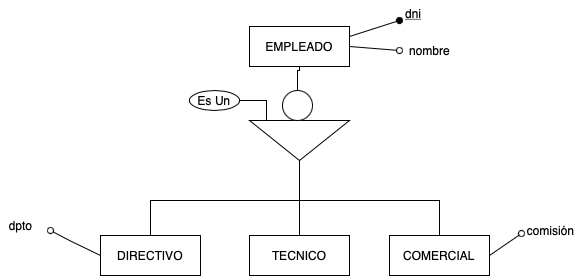
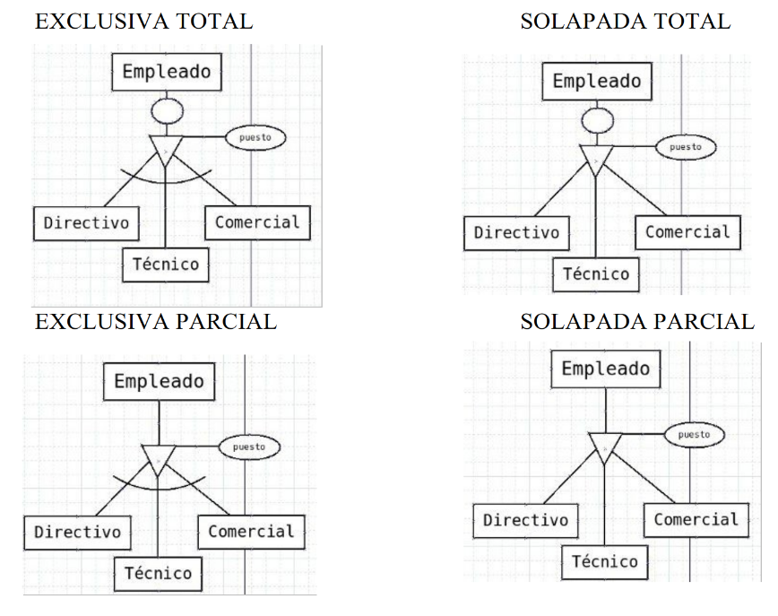

Realmente lo que hay que matizar bien en las relaciones **es un (IS A)** es la forma de relacionarse la superentidad con la subentidad. Se puede agregar más semántica al diagrama entidad-relación extendido combinando los siguientes tipos de especialización:

- **Especialización Solapada.** Se produce cuando las ocurrencias de la superclase se pueden materializar a la vez en varias ocurrencias de las subclases. En este caso, un empleado podría ser un directivo y también un técnico y/o un comercial. Se representan sin el arco.

{.center}

- **Especialización Exclusiva.** En este caso, cada una de las ocurrencias de la superclase solo puede materializarse en una de las especializaciones. (si un empleado es un directivo, no puede ser un técnico ni un comercial). Para representar esta exclusividad se dibuja un arco cerca del triángulo.

{.center}

- **Especialización Total.** Se produce cuando la entidad superclase tiene que materializarse obligatoriamente en una de las especializaciones. En este caso, no puede haber un empleado que no sea ni un directivo, ni un técnico y ni un comercial. Se representan añadiendo un pequeño círculo al triángulo de la generalización.

{.center}

- **Especialización Parcial.** La entidad superclase no tiene por qué materializarse en una de las especializaciones (podría suceder que un empleado no sea ni comercial, ni técnico ni directivo). Se representa sin el pequeño círculo

{.center}

Las cuatro posibles combinaciones serían las siguientes:

{.center}

!!! tip "NOTA"
    Cuando definimos un atributo podemos hacerlo por extensión (especificando una lista de todos los posibles valores). Eso no quiere decir que haya que hacer una ISA (especialización o generalización). Por ejemplo, Si decimos que de un cliente vamos a guardar el sexo, Hombre o Mujer, no quiere decir que tengamos que hacer una especialización de Cliente, sino que tenemos un atributo, Sexo, que tiene unos valores definidos que pondremos en el diccionario de datos.
