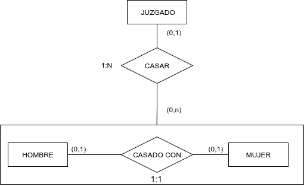

La agregación surge de la limitación que existe en el modelo ER de no permitir expresar relaciones entre relaciones.

En el modelo ER extendido, la agregación representa la creación de un objeto compuesto a partir de una relación entre entidades, de tal forma que éste se comporta como una entidad más, aunque de un nivel de abstracción mayor.

Sea, por ejemplo, el caso de `HOMBRES` y `MUJERES` que se unen en matrimonio (hemos obviado los atributos de las entidades para no complicar el diagrama). El hecho de que un hombre y una mujer se casen no significa que obligatoriamente lo hagan por lo civil (entendiendo como tal la acción de casarse ante una autoridad civil no eclesiástica). Sin embargo, para aquellas parejas que no hayan celebrado ceremonia religiosa, nos interesa saber el juzgado en que se han casado.

{ .center }

Evidentemente, si atendemos a la conectividad de la relación `CASADO_CON`, un hombre sólo se puede casar con una única mujer y viceversa (en nuestro sistema de información). Si lo hicieran por lo civil, pasarían por un único juzgado, mientras que el mismo juzgado podría haber casado a muchas parejas.

El mecanismo de agregación lo que hace es abstraer las entidades y la relación que las asocia para obtener una entidad compleja, que a su vez puede relacionarse como una entidad normal con el resto de entidades de nuestro sistema.

Aunque tiene muchos puntos de contacto con una ternaria, la agregación remarca la relación entre una determinada pareja de entidades, al mismo tiempo que no implica una necesaria asociación con la tercera entidad, como si ocurría en las ternarias.
