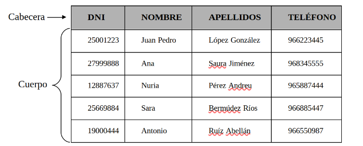

La estructura fundamental del modelo es la **tabla** o **relación**, representación de la información referente a un objeto; representa una entidad genérica. Una tabla está formada por columnas y filas, cada **columna** representa un atributo de la entidad genérica y cada **fila o tupla** representa una entidad concreta, una ocurrencia o ejemplar.

Una tabla o relación está formada por dos partes principales: cabecera y cuerpo. La **cabecera** es un conjunto fijo de atributos. El **cuerpo** es un conjunto de tuplas variable en el tiempo.

El número de filas o tuplas en una tabla recibe el nombre de **cardinalidad**. El número de columnas o atributos en una tabla recibe el nombre de **grado**.

**TABLA “CLIENTES”**

{.center}

Cardinalidad de “CLIENTES”: 5

Grado de “CLIENTES”: 4

Ejemplo de tupla de CLIENTES: (27999888, Ana, Saura Jiménez, 968345555)

!!! Inf "Información"
    La **Cabecera de la tabla** es invariante en el tiempo (a no ser que cambie el diseño), sin embargo, el **Cuerpo de la tabla** varía en el transcurso del tiempo, así como la **Cardinalidad**.

A la hora de definir una tabla debemos tener en cuenta que no se pueden repetir el nombre las columnas, aunque sí en diferentes tablas. No pueden haber dos registros iguales esto hace que se evite la redundancia de información. Todas las tuplas deben de tener el mismo numero de campos aunque en alguno de ellos tenga un valor `NULL`.

!!! info "Definición"
    Un **dominio** es el **conjunto de valores válidos que puede tomar un atributo (columna)** de una tabla.

- Texto
- Numérico
- Fecha/hora
- Booleno
- Autonumérico

A la hora de definir una tabla en el Modelo Relacional lo haremos de la siguiente manera:

`nombre_tabla(columna1:dominio,columna2:dominio,...)`

`CLIENTES(DNI:texto,NOMBRE:texto,APELLIDOS:texto,TELEFONO:texto)`
