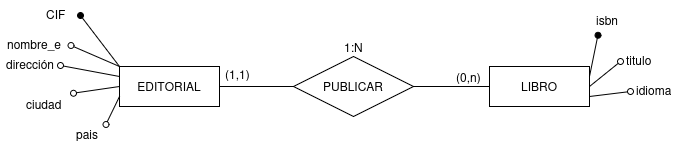
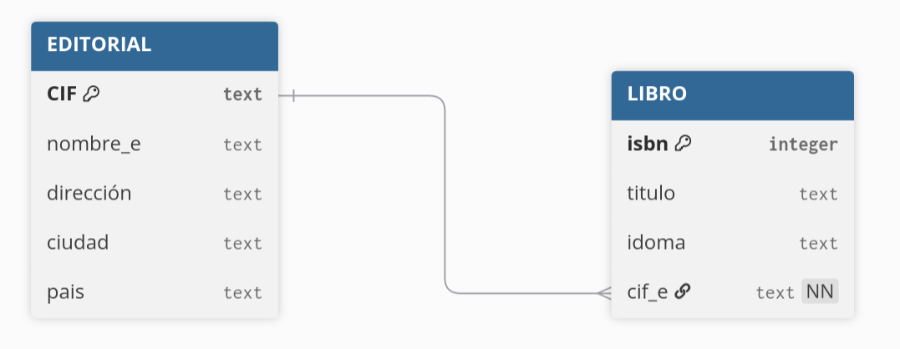

Una **clave candidata** de una tabla es un conjunto no vacío de atributos que identifican unívoca y mínimamente cada tupla. Una tabla puede tener más de una clave candidata, entre las cuales se debe distinguir:

- **Clave primaria** (Primary Key o PK): es aquella clave candidata que el usuario escogerá, por consideraciones ajenas al modelo relacional, para identificar las tuplas de la tabla.

- **Claves alternativas**: son aquellas claves candidatas que no han sido escogidas como clave primaria.

Se denomina **clave ajena** (clave foránea, Foreign Key o FK) de una tabla a un conjunto no vacío de atributos (columnas) cuyos valores han de coincidir con los valores de la clave primaria de otra tabla. Es decir, la clave ajena de una tabla es el atributo o conjunto de atributos que forman la clave primaria de otra tabla.

!!! Tip "Información"
    Cabe destacar que la clave ajena y la correspondiente clave primaria han de estar definidas sobre el mismo **dominio**.

En el modelo E/R seria:

{.center}
*imagen: relación 1:N representado modelo Entidad Relación*{.center}
```bash
EDITORIAL ( cif:texto, nombre_e:texto, direccion:texto, ciudad:texto, pais:texto)

    PK: cif

LIBRO( isbn:numero, titulo:texto, idioma:texto,.... , cif_e:texto )

    PK: isbn
    FK: cif_e → EDITORIAL
```

Esta clave que referencia a EDITORIAL debe concordar con la clave primaria de EDITORIAL.

{.center}
*imagen: relación 1:N representado en modelo relacional*{.center}

```bash
Table EDITORIAL {
  CIF text [primary key]
  nombre_e text
  dirección text
  ciudad text
  pais text
}

Table LIBRO {
  isbn integer [primary key]
  titulo text
  idoma text 
  cif_e text [not null, ref:> EDITORIAL.CIF]
  }
```

Código para generar modelo lógico en [dbdiagram.io](https://www.dbdiagram.io)
