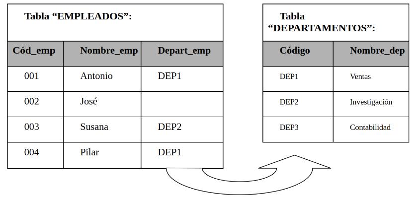
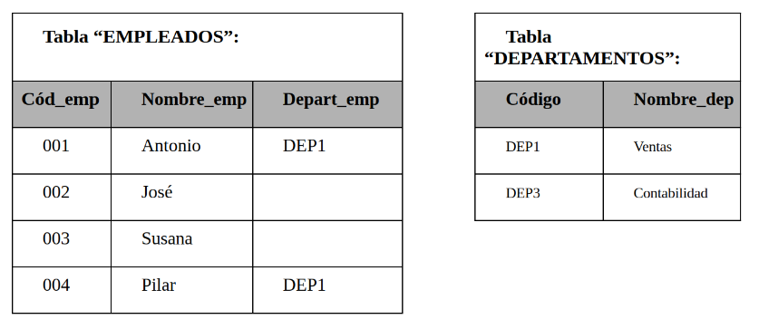
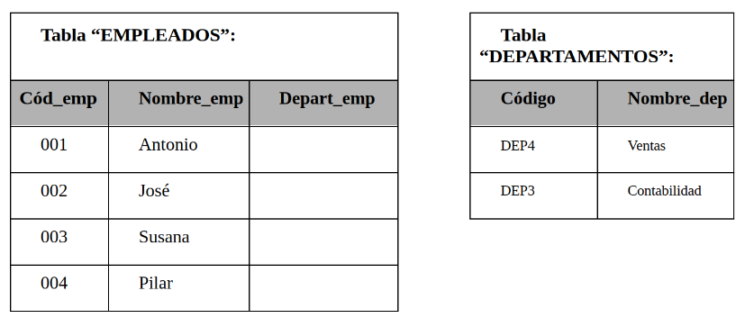
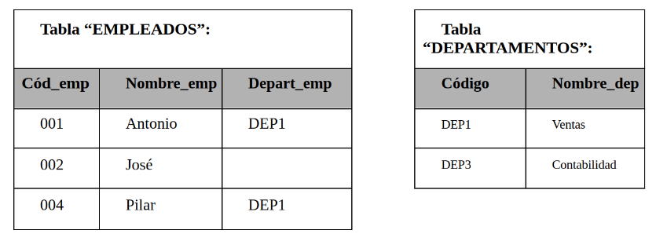
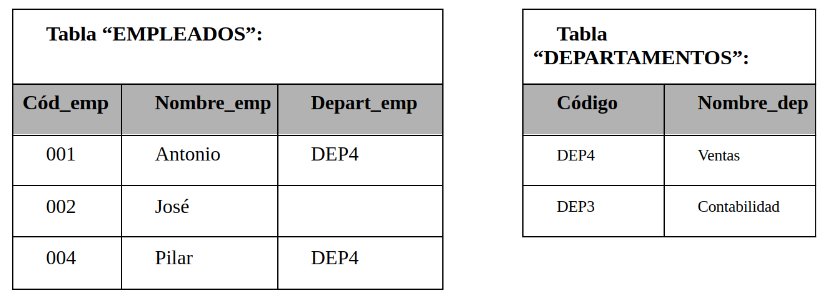

Dentro de las restricciones destaca la **Restricción de integridad referencial** que establece que *“Si una tabla T1 contiene un atributo que es clave ajena de T2 (es decir, a la clave primaria en T2), su valor debe: o bien coincidir con el valor que tenga como clave primaria en T2, o bien ser nulo”*. Esta restricción se define en el esquema y el SGBD la reconoce sin necesidad de que se programe ni de que se tenga que escribir ningún procedimiento para obligar a que se cumpla.

Si el SGBD posee mecanismos de claves ajenas, debe garantizar la integridad referencial. Suponiendo que disponga de toda la información necesaria sobre claves (primarias y ajenas, al menos) se encuentra con el problema de las actualizaciones y borrados de claves primarias referenciadas por alguna clave ajena.

Veamos un ejemplo; consideremos el siguiente caso:

{.center}

Observemos que en la tabla `EMPLEADOS` existe una clave ajena hacia `DEPARTAMENTOS` (campo Depart_emp).

Supongamos que se pretende borrar de la tabla `DEPARTAMENTOS` la tupla del “departamento de Investigación”: `DEP2, Investigación`. Si lo hiciéramos, la tupla de “Susana” en `EMPLEADOS` tendría su clave ajena apuntando a un valor de clave primaria que no existe en `DEPARTAMENTOS`, lo que violaría la integridad referencial.

También se puede dar el caso de que dicho departamento de Investigación cambie de clave primaria y pase a identificarse como “DEP5”. Nuevamente, si no tomamos las medidas oportunas, estaríamos violando la integridad referencial.

En definitiva, para actualizaciones y borrados de tuplas referenciadas por claves ajenas en otras tablas, el SGBD debe conocer, por las especificaciones oportunas en el esquema de la BD, cuál de las siguientes estrategias debe utilizar para garantizar la restricción:

- Rechazar
- Anular
- Propagar

Veamos cada una de esas estrategias:

**RECHAZAR**

El SGBD sólo permitirá la operación en caso de que no produzca problemas. En nuestro ejemplo no dejaría que realizásemos la operación.

**ANULAR**

El SGBD pondrá a nulos todas las claves ajenas que hagan referencia a la clave primaria que sufre la operación. En nuestro ejemplo, si pretendemos borrar la tupla de “Investigación”, la tupla de “Susana” quedaría con el atributo `Depart_emp` con valor nulo:

{.center}

Supongamos ahora, que para actualizar el departamento de Ventas a un nuevo código, cambiándolo de “DEP1” a “DEP4”, adoptamos la misma estrategia. Obtendríamos:

{.center}

**PROPAGAR**

También conocida como “en cascada”, reproduce la operación sobre todas las tuplas que hagan referencia a la clave primaria. Si partimos nuevamente del ejemplo anterior (en el estado inicial de las tablas) y borramos la tupla del departamento de Investigación, la tupla de “Susana” también sería borrada:

{.center}

Y en el caso añadido de la actualización antes mencionada del departamento de Ventas, quedaría así:

{.center}

Ya conocemos las distintas estrategias que puede seguir el SGBD para mantener la integridad referencial, pero: ¿cómo podemos indicarle la estrategia que ha de seguir en cada momento? Cada SGBD dispone de herramientas para especificar la estrategia a seguir para garantizar la restricción de integridad referencial.

```SQL
[CONSTRAINT símbolo] FOREIGN KEY (nombre_columna, ...) REFERENCES nombre_tabla (nombre_columna, ...) 
                  [ON DELETE {CASCADE | SET NULL | NO ACTION| RESTRICT}]
                  [ON UPDATE {CASCADE | SET NULL | NO ACTION| RESTRICT}]
```
