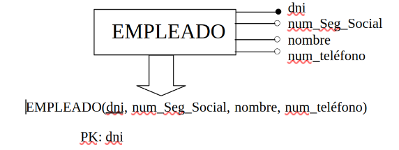

A esta conversión de un esquema conceptual E/R a un esquema lógico relacional también se le denomina **"paso a tablas"**. Este paso a tablas está basado en una serie de normas y pasos a seguir. A través de éstos se va generando el esquema relacional, es decir, el conjunto de tablas que finalmente se implementarán en el SGBD, y las restricciones o reglas de integridad que deben cumplir.

**ENTIDADES**

Por cada entidad del esquema E/R construiremos una tabla con su nombre y sus atributos (incluida la clave primaria).
Un posible formato para indicar el esquema de una tabla sería este:

<strong>NOMBRE_TABLA</strong> (Atributo1:Tipo_dato, Atributo2 :Tipo_dato, Atributo3: Tipo_dato)

PK: atributo1

Subrayaremos el atributo (o atributos) que formen parte de la clave primaria y abajo definiremos todas las restriciones (VNN, FK, enum, default, check).

{.center}

