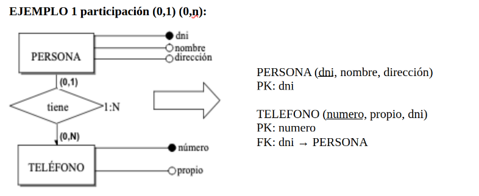
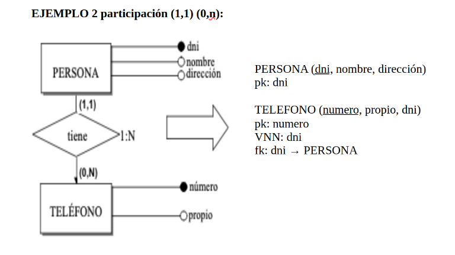
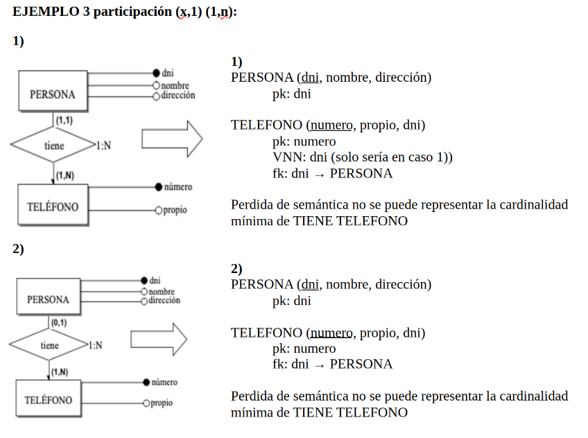
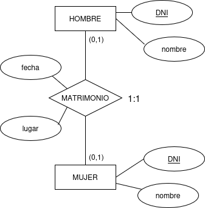
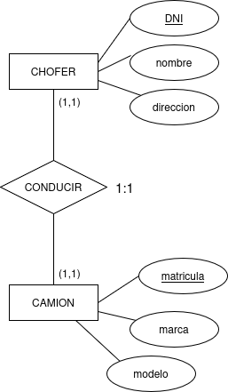
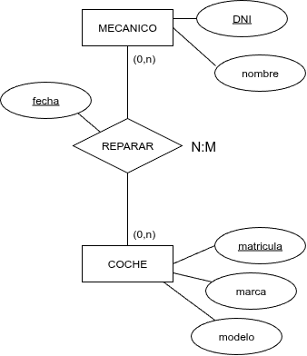

**RELACIONES BINARIAS**

Recordemos que las relaciones binarias son aquellas entre dos entidades. Este tipo de relaciones podrán o no generar una tabla, dependiendo de su cardinalidad

**1. Relaciones con Cardinalidad 1:N**

La clave primaria de la entidad 1 se incluye en la entidad N como clave ajena. Si en la relación hubieran atributos (campos) estos se incluirían en la en la entidad N.

{.center}

De esta manera podemos ver que dado un teléfono podemos tener una persona y dado un telefono podemos tener una o varias personas cumpliendo la relación 1:N.

{.center}

Al poner en el atributo `dni` la restricción de `Valor No Nulo` estamos haciendo que todos los teléfonos tengan una persona haciendo cumplir la particiàción (1,1).

{.center}

!!!tip "Recuerda"
    La clave ajena conceptualmente es la propagación de la clave primaria de la entidad del muchos a la entidad del 1, esta columna que añadimos en la entidad del 1 es normal que utilicemos el mismo nombre que la clave primaria a la que apunta, pero podemos cambiarla y poner un nombre que nos facilete su compresión. En lo que tienen que coincidir la FK y PK es en tener el mismo tipo de datos.

**2. Relaciones con Cardinalida 1:1**

EJEMPLO 1 partición (0,1) (0,1)

En este caso añadiremos en cualquier entidad la clave ajena y ademas le añadiremos la resticción de campo `UNIQUE/UK`.

{.center}

**opción 1**

<strong>HOMBRE</strong> (dni , nombre)

PK: dni

<strong>MUJER</strong> (dni , nombre, dni_hombre, fecha, lugar)

PK: dni

FK: dni_hombre → HOMBRE

UK: dni_hombre

**Opción 2**

<strong>HOMBRE</strong> (dni , nombre, dni_mujer, fecha, lugar)

PK: dni

FK: dni_mujer → MUJER

UK: dni_mujer

<strong>MUJER</strong> (dni , nombre)

PK: dni

Ambas soluciones son equivalente, al poner el campo que es clave ajena como clave única restringimos que su valor se pueda repetir, de esta manera en ambos casos se cumple la cardinaldad 1:1 con participación (0,1) (0,1).

!!!question "ejercicio"
    Crea una tabla con datos para la entidad MUJER y otra para la entidad HOMBRE elige la opción 1 y comprueba que se cumple la cardinalida y la participación. Haz lo mismo con la opción 2.

EJEMPLO 2 partición (0,1) (1,1)

{.center}

En este caso tenemos una restricción más por la Participación(CAMION,CONDUCIR)=(1,1) por lo que en este caso sólo hay una opción hacer que la clave ajena además se clave alternativa con lo que no puede ni repetirse ni ser null.

<strong>CHOFER</strong> (dni , nombre, direccion)

PK: dni

<strong>CAMION</strong> (matricula , marca, modelo, dni)

PK: matricula

FK: dni → CHOFER

AK: dni

!!!question "ejercicio"
    Comprueba haciendo tablas de datos de este Modelo Relacional que se cumple el modelo Entidad-Relación la cardinalidad 1:1 con la participación (0,1) y (1,1).
EJEMPLO 3 participación (1,1) (1,1)

{.center}

En este caso la participación mínima en ambas entidades es de 1, con lo que la única forma de representar esta particación es creado un única tabla con la clave primaria de una entidad y la otra como clave alternativa.

<strong>CONDUCIR</strong> (dni ,nombre, direccion, matricula, marca, modelo)

PK: dni

AK: matricula

!!!question "ejercicio"
    Comprueba haciendo una tabla de datos de este Modelo Relacional que se cumple el modelo Entidad-Relación la cardinalidad 1:1 con la participación (1,1) y (1,1).

**3. Relaciones con Cardinalidad N:M**

En el caso de la relaciones binaria muchos a muchos el paso al Modelo Relacional se traduce en una nueva tabla cuya clave primaria se compone de las claves primarias de la tablas relacionadas y cada clave primaria es clave ajena.

Ejemplo N:M

{.center}

<strong>MECANICO</strong> (dni, nombre)

PK: dni

<strong>COCHE</strong> (matricula, marca, modelo)

PK: matricula

<strong>REPARAR</strong> (dni, matricula,fecha)

PK: (dni, matricula)

FK: dni → MECANICO

FK: matricula → COCHE

!!!question "Ejercicio"
    Realiza las tablas con datos para probar que este Modelo Relacional representa la cardinalidad N:M. ¿Has encontrado algún problema? ¿Cual? ¿Cómo se podría solucionar?

**4. Relación N:M con marca de temporalidad**

Si la relación N:M tiene atributos de tipo fecha será conveniente añadirlo a la clave primaria. En el ejemplo anterior vemos que si añadimos el campo fecha a la clave primaria un mecánico puede reparar el un mismo coche en fechas diferentes.

{.center}

<strong>MECANICO</strong> (dni, nombre)

PK: dni

<strong>COCHE</strong> (matricula, marca, modelo)

PK: matricula

<strong>REPARAR</strong> (dni, matricula, fecha)

PK: (dni, matricula, fecha)

FK: dni → MECANICO

FK: matricula → COCHE

!!!question "Ejercicio"
    Comprueba que se ha corregido el problema anterior.
