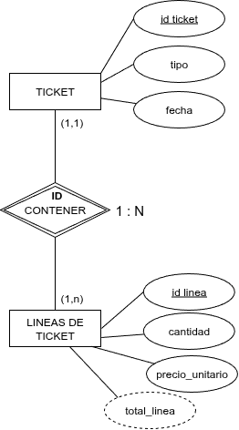

Cuando exista este tipo de dependencia, la clave primaria de la entidad fuerte debe introducirse en la tabla de la entidad débil y formar parte de la clave primaria de ésta, actuando además como clave ajena.

{.center}

<strong>TICKET</strong> (id_ticket, tipo, fecha)

PK: id_ticket

<strong>LINEAS DE TICKET</strong> (id_linea, cantidad, precio_unitario)

PK: (id_linea, id_ticket)

FK: id_ticket → TICKET

!!!danger "CUIDADO"
    Fijaros que el **campo derivado** o calculado no se ha pasado al modelo relacional, es decir, no se almacena ya que se calculará a partir de los datos almacenados.
