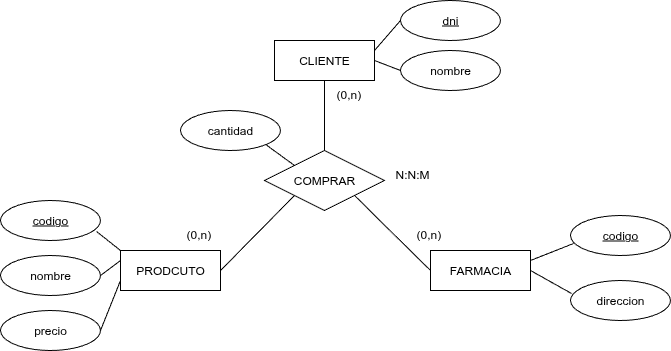

Se crea una nueva tabla con la unión de las claves primarias de las entidades relaciones. Si una de las entidades tiene cardinalidad máxima 1, se queda fuera de la PK, con la única salvedad que la PK tiene que estar formada como mínimo por dos campos en el caso 1:1:N la PK de la nueva tabla está formada por la PK de la parte del muchos y una de la PK (la que queramos) de la parte del 1.
Se crean tantas claves ajenas como entidades relacionadas.

{.center}

<strong>CLIENTE</strong> (dni, nombre)

PK: dni

<strong>PRODUCTO</strong> (codigo, nombre, precio)

PK: codigo

<strong>FARMACIA</strong> (codigo, direccion)

PK: codigo

<strong>COMPRAR</strong> (dni, cod_prod, cod_far, cantidad

PK: (dni, cod_prod, cod_far)

FK: dni → CLIENTE

FK: cod_prod → PRODUCTO

FK: cod_far → FARMACIA

