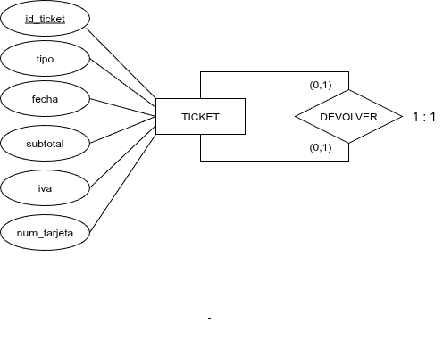

La forma de actuar será la explicada para las relaciones binarias, dependiendo de la cardinalidad de la relación.

Si hay que añadir la clave principal como clave ajena en la misma tabla, se debe renombrar.

{.center}

<strong>TICKET</strong> (id_ticket, tipo, fecha, subtotal, iva, num_tarjeta, id_ticket_devolucion)

PK: id_ticket

FK: id_ticket_devoluacion → TICKET

UK: id_ticket_devolucion

