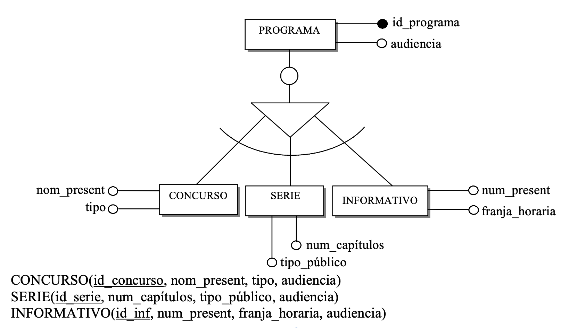
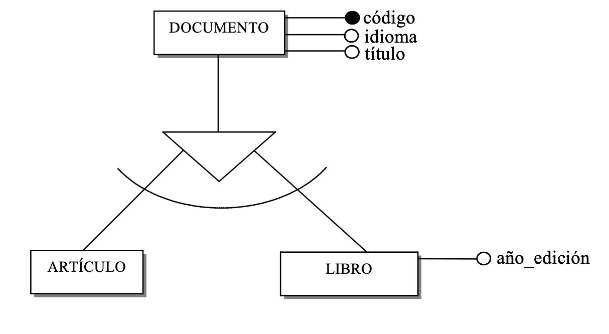
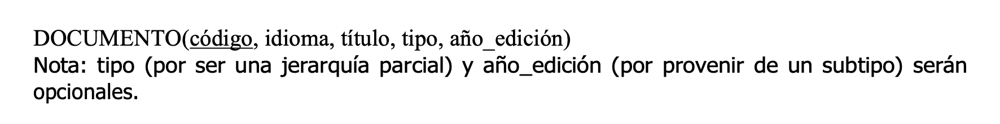
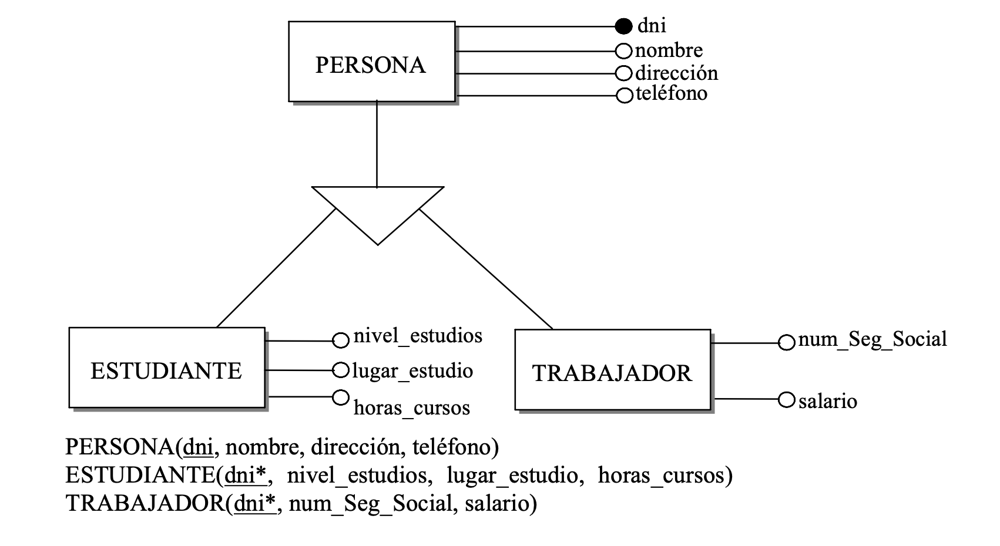

En lo que respecta a las jerarquías de entidades, no son objetos que se puedan representar explícitamente en el modelo relacional. Ante una jerarquía de entidades, caben varias soluciones de transformación al modelo relacional, con la consiguiente pérdida de semántica dependiendo de la estrategia elegida. Destacamos tres:

**1. DIVIDIR**

Consiste en:

- Crear una tabla por cada subtipo, heredando los atributos del supertipo, incluyendo la clave primaria, la cual pasará a ser la clave primaria de las nuevas tablas.
- La entidad supertipo desaparece.
- Todas las relaciones que tenía el supertipo, ahora pasan a multiplicarse como relaciones en los subtipos. Por tanto, habrá que estudiar esas nuevas relaciones y hacer las transformaciones pertinentes según lo visto en puntos anteriores.

Se realiza cuando el concepto del supertipo no se utiliza, y los subtipos son la información relevante.

También se detecta porque las relaciones y las operaciones que se realizan en la base de datos son siempre sobre los subtipos.

{.center}

**2. COLAPSAR**

Consiste en integrar todas las entidades (supertipo y subtipos) en una tabla, incluyendo en ella los atributos de la entidad padre y los atributos de todos los hijos como opcionales.

En general, adoptaremos esta solución cuando los subtipos se diferencien en muy pocos atributos y las relaciones que los asocian con el resto de entidades del esquema sean las mismas para todos (o casi todos) los subtipos.

Para saber a qué subtipo pertenece cada instancia de la tabla podríamos añadir un **atributo discriminante** (el atributo discriminante de la jeraquía) que indique el caso al cual pertenece la entidad en consideración. Si la jerarquía es solapada, el atributo discriminante será multivaluado (en ese caso es importante recordar que ese atributo requerirá una transformación posterior). Si es total será obligatorio.

Las relaciones que había sobre los subtipos, ahora son sobre el supertipo. Por tanto, habrá que estudiar esas relaciones y hacer las transformaciones pertinentes según lo visto en puntos anteriores.

Una desventaja es que ahora **habrá muchos valores nulos posibles**.

{.center}
{.center}

**3. EXPLICITAR**

Consiste en crear una tabla para el supertipo y tantas tablas como subtipos haya, con sus atributos correspondientes.

Si uno de los subtipos no posee ningún atributo ni ninguna relación propios, ese subtipo desaparece y no se le asigna tabla. En ese caso, si se trata de una jerarquía disjunta, el atributo discriminante de la jerarquía se incorpora en la tabla de la entidad supertipo.

Las tablas de los subtipos heredan como clave primaria la del supertipo. Por lo tanto, la clave primaria de las tablas de los subtipos es también una clave ajena a la del supertipo.

Adoptaremos esta opción cuando existe distinción entre el supertipo y los subtipos, y unas veces se actúa sobre el supertipo y otras veces sobre los subtipos, existiendo también relaciones distintas de otras entidades con el supertipo y con los subtipos.

Es la solución adecuada cuando existen muchos atributos distintos entre los subtipos y se quieren mantener de todas maneras los atributos comunes a todos ellos en una tabla.

Normalmente esto ocurre en jerarquías parciales, aunque esta opción sirve para cualquier tipo de jerarquía.

{.center}
